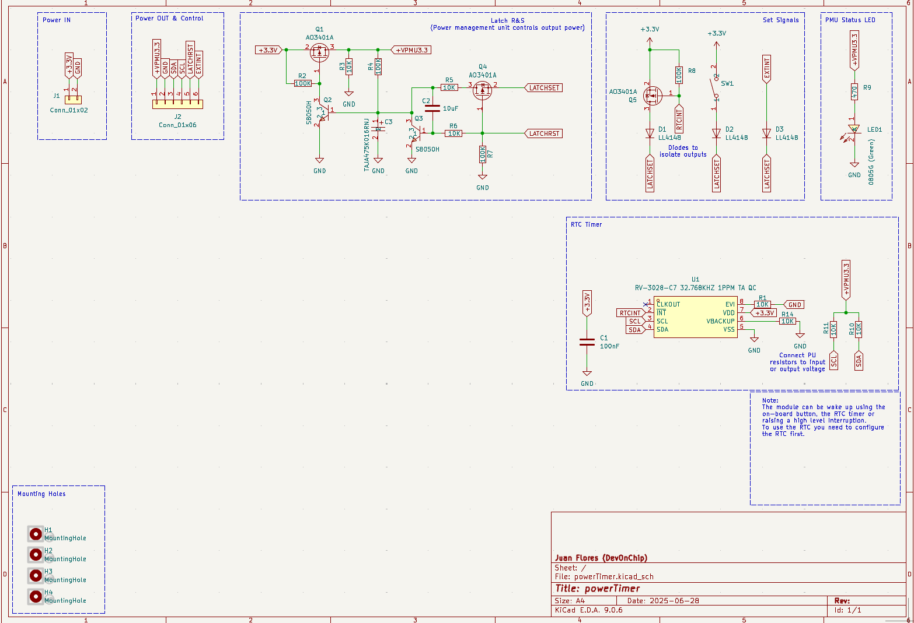
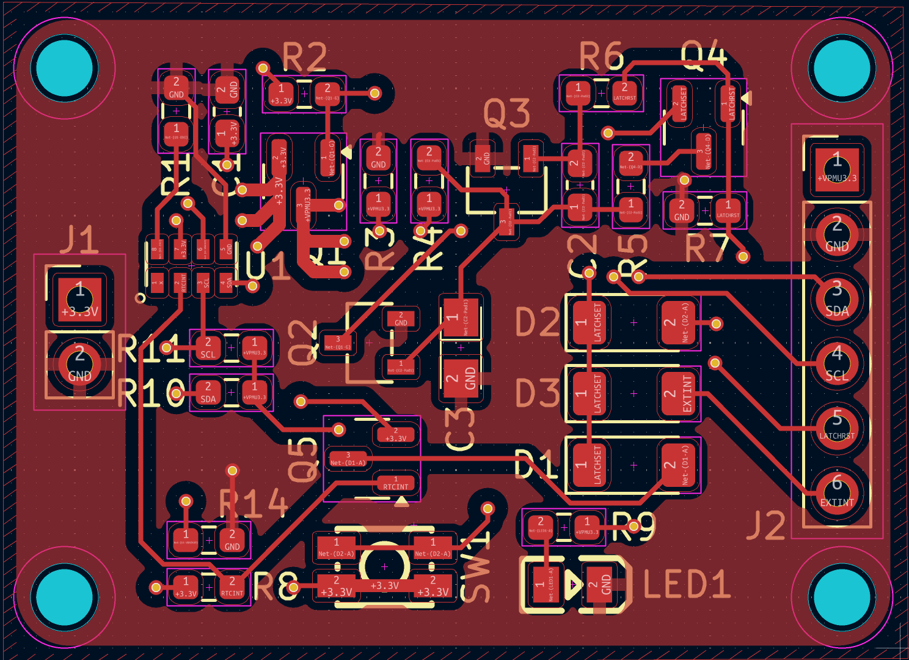

# Power Timer

## Project Description

The Power Timer is an ultra-low power module that allows you to control the output power by software. It is mainly based on a Real-Time Clock (RTC) and an RS circuit. Thanks to the RTC, you can control the exact wake-up date or the periodicity. It also allows for external interruptions, which gives you the benefits of ultra-low power consumption while being able to connect other types of sensors. The module is based on the RV3028-C7 chip. It is also compatible with Arduino, thanks to its custom library.

The sleep current of the module is around 60nA at 3.3V, making it ideal for battery-powered applications.

## How it works

The module is designed to be a versatile power control unit for your projects. It can be used as a simple timer to power on a device at a specific time or periodically, or it can be used as a power management unit that can be woken up by external events.

The PCB is divided into two parts:

*   **Input:** The input voltage (VINput) can be from 1.1V to 5.5V. This wide input range makes it compatible with a variety of power sources, from a single-cell Li-Po battery to a 5V power supply.

*   **Output:**
    *   **I2C:** The I2C pins (SDA and SCL) are used to program the RV3028-C7 RTC. You can set the time, date, and alarms using any microcontroller with I2C capabilities.
    *   **VOutput:** This pin will provide the same voltage as the input. When the module is in the "ON" state, the VOutput pin is connected to the VINput pin, providing power to your external device.
    *   **PWR_OFF:** This input allows you to externally cut off the power of the module. By pulling this pin high, you can force the module into the "OFF" state, even if the RTC alarm is active.
    *   **EXT_INT:** This input allows you to wake up the module externally using another sensor. This is useful for applications where you want to wake up the main device based on an external event, such as a button press or a sensor reading.
    *   **On-board button:** A push button is available on the board for manual wake-up. This allows you to turn on the module without relying on the RTC alarm or an external interrupt.

The logic levels of the I2C bus and the external interrupt input depend on the selected input voltage.

## Schematic

## PCB Layout

